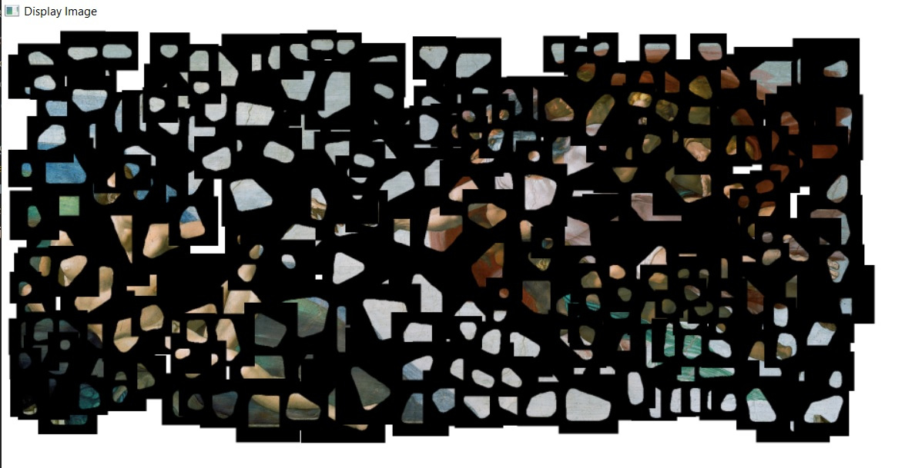
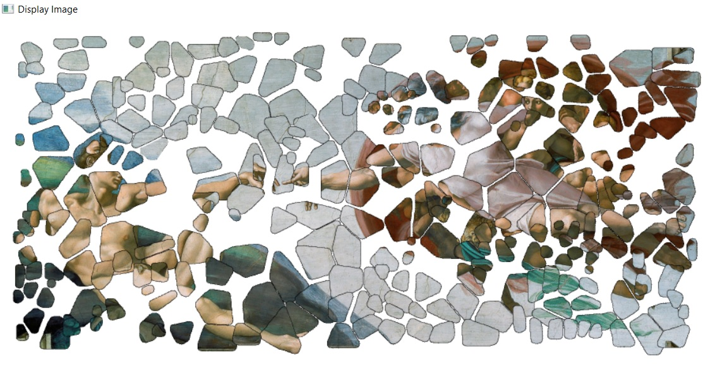
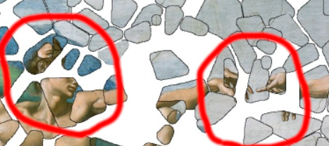
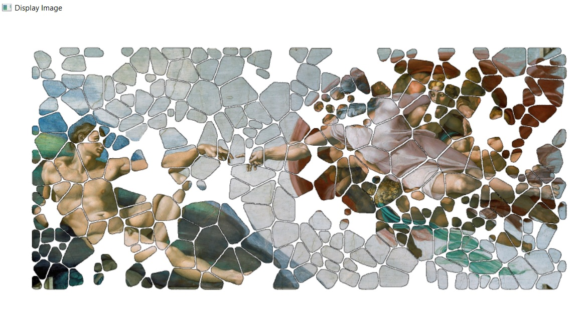
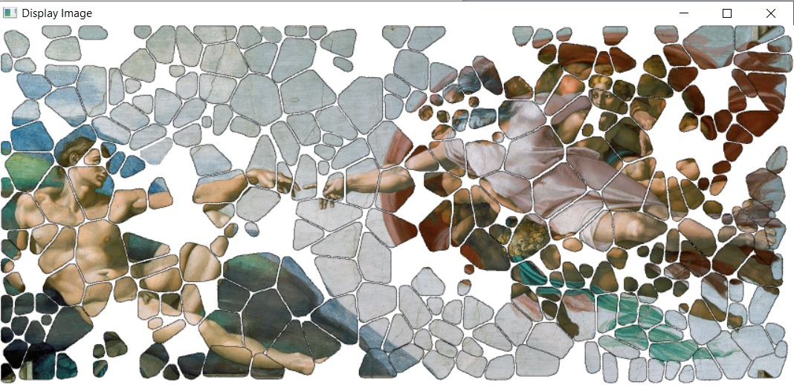

# TP1
## Erreur de copie des fragments

Lors de la copie des fragments, nous avions des problèmes, les fragments été copiés avec un fond noir de la taille de l'image :



Nous avons identifié que le problème était causé par notre façon de copier le fragment dans la mosaïque :

```c++
rotated_frag.copyTo(mix);
```

En effet il est possible de rajouter en deuxième paramètre de `copyTo` une matrice correspondant à un masque de fusion du fragment, on récupère ce masque en isolant la couche alpha du fragment `channels[3]`:

```c++
// Mask
std::vector<cv::Mat> channels(4);
cv::split(rotated_frag, channels);
// Copy
rotated_frag.copyTo(mix, channels[3]);
```

On obtient alors :


## Mauvais positionnement des fragments

On a constaté un mauvais positionnement des fragments avec notre méthode intiale :



On a identifié que les positions fournies dans le fichier de solution correspondait au centre du fragment et non pas au coin gauche inférieur, ainsi on a du modifié :

```c++
// Mix
cv::Mat mix = M(cv::Rect(fragment_solutions.heigth, fragment_solutions.width, rotated_frag.cols, rotated_frag.rows));
```

On a du rajouté un offset pour placer avec le milieu du fragment :

```c++
// Mix
cv::Mat mix = M(cv::Rect(fragment_solutions.heigth - image.rows / 2.0, fragment_solutions.width - image.cols / 2.0, rotated_frag.cols, rotated_frag.rows));
```

On obtient alors :



# Fragments dépassant du bord

Pour certains fragment, leur placement débordait du cadre de l'image finale, cela entraînait une erreur à l'éxécution :

```shell
terminate called after throwing an instance of 'cv::Exception'
  what():  OpenCV(4.5.4) ./modules/core/src/matrix.cpp:810: error: (-215:Assertion failed) 0 <= roi.x && 0 <= roi.width && roi.x + roi.width <= m.cols && 0 <= roi.y && 0 <= roi.height && roi.y + roi.height <= m.rows in function 'Mat'

Abandon (core dumped)

```

On a donc corrigé le problème en enlevant pour chaque fragment, la portion qui dépassait du bord de l'image :

```c++

```

Ainsi on obtient une image de la  bonne taille :

