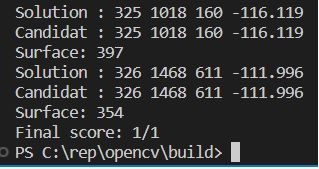
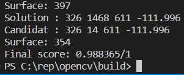

# TP1

## Erreur de copie des fragments

Lors de la copie des fragments, nous avions des problèmes, les fragments été copiés avec un fond noir de la taille de l'image :


Nous avons identifié que le problème était causé par notre façon de copier le fragment dans la mosaïque :

```c++
rotated_frag.copyTo(mix);
```

En effet il est possible de rajouter en deuxième paramètre de `copyTo` une matrice correspondant à un masque de fusion du fragment, on récupère ce masque en isolant la couche alpha du fragment `channels[3]`:

```c++
// Mask
std::vector<cv::Mat> channels(4);
cv::split(rotated_frag, channels);
// Copy
rotated_frag.copyTo(mix, channels[3]);
```

On obtient alors :


## Mauvais positionnement des fragments

On a constaté un mauvais positionnement des fragments avec notre méthode intiale :


On a identifié que les positions fournies dans le fichier de solution correspondait au centre du fragment et non pas au coin gauche inférieur, ainsi on a du modifié :

```c++
// Mix
cv::Mat mix = M(cv::Rect(fragment_solutions.heigth, fragment_solutions.width, rotated_frag.cols, rotated_frag.rows));
```

On a du rajouté un offset pour placer avec le milieu du fragment :

```c++
// Mix
cv::Mat mix = M(cv::Rect(fragment_solutions.heigth - image.rows / 2.0, fragment_solutions.width - image.cols / 2.0, rotated_frag.cols, rotated_frag.rows));
```

On obtient alors :


# Fragments dépassant du bord

Pour certains fragment, leur placement débordait du cadre de l'image finale, cela entraînait une erreur à l'éxécution :

```shell
terminate called after throwing an instance of 'cv::Exception'
  what():  OpenCV(4.5.4) ./modules/core/src/matrix.cpp:810: error: (-215:Assertion failed) 0 <= roi.x && 0 <= roi.width && roi.x + roi.width <= m.cols && 0 <= roi.y && 0 <= roi.height && roi.y + roi.height <= m.rows in function 'Mat'

Abandon (core dumped)

```

On a donc corrigé le problème en enlevant pour chaque fragment, la portion qui dépassait du bord de l'image :

```c++
// Truncate image
// Diffs are rounded up if not whole
int diff_top = fragment_solutions.heigth - ceil(rotated_frag.rows / 2.0) < 0 ? -1 * (fragment_solutions.heigth - ceil(rotated_frag.rows / 2.0)) : 0;

int diff_left = fragment_solutions.width - ceil(rotated_frag.cols / 2.0) < 0 ? -1 * (fragment_solutions.width - ceil(rotated_frag.cols / 2.0)) : 0;

int diff_bottom = fragment_solutions.heigth + ceil(rotated_frag.rows / 2.0) - canvas_height > 0 ? fragment_solutions.heigth + ceil(rotated_frag.rows / 2.0) - canvas_height : 0;

int diff_right = fragment_solutions.width + ceil(rotated_frag.cols / 2.0) - canvas_width > 0 ? fragment_solutions.width + ceil(rotated_frag.cols / 2.0) - canvas_width : 0;

// We crop the frag by removing the previous founded diffs
int trunc_width = rotated_frag.cols - diff_left - diff_right;
int trunc_height = rotated_frag.rows - diff_top - diff_bottom;

cv::Mat truncMat = rotated_frag(cv::Rect(diff_left, diff_top, trunc_width, trunc_height));

// Mix
int x_original_center = fragment_solutions.width;
int x_truncated_center = x_original_center - diff_left - diff_right;
int x_position = x_truncated_center - truncMat.cols / 2;

int y_original_center = fragment_solutions.heigth;
int y_truncated_center = y_original_center - diff_top - diff_bottom;
int y_position = y_truncated_center - truncMat.rows / 2;

x_position = x_position < 0 ? 0 : x_position;
y_position = y_position < 0 ? 0 : y_position;

cv::Mat mix = M(cv::Rect(x_position, y_position, truncMat.cols, truncMat.rows));
```

Ainsi on obtient une image de la bonne taille :


# Partie 2

Nous n'avons pas rencontré de difficultés particulières dans cette partie du tp.

Notre programme parcours les 2 fichiers, pour chaque fragment on calcule les différents deltas. Puis on calcule la surface du fragment, pour cela on récupère le channel alpha de chaque image.

Notre programme nous donne cette précision avec un fichier solution.txt identique à fragments.txt :



Avec un fichier solution.txt différent de fragments.txt :


