# TP2

## Exercice 1

### 1. Pour l’image four.png fournie, de taille 100 × 100 pixels, considérons que rmin = 1, rmax = 100, δr = 2. Combien de valeurs discrètes aura-t-on pour la coordonnée r des cercles ? Et si δr = 0.5 ?

$nombre\,valeurs\,discrètes = \dfrac{rmax - rmin + 1}{δr}$

- Pour : $δr = 2$ $\implies$ $\dfrac{100 - 1 + 1}{2} = 50$

- Pour : $δr = 0.5$ $\implies$ $\dfrac{100 - 1 + 1}{0.5} = 200$

### 2. Pour la même images, en supposant que rmin = 1, rmax = 100, δr = 1, cmin = 1, cmax = 100, δc = 1,radmin = 5, radmax = 100 $\sqrt{2}$, δrad = 1, quel est le nombre total de cercles qu’on peut d´ecrire avec ces trois variables ?

$nombre\,total\,de\,cercle = \dfrac{rmax - rmin + 1}{δr} \times \dfrac{cmax - cmin + 1}{δc} \times \dfrac{radmax - radmin + 1}{δrad}$

Donc :

---

$nombre\,total\,de\,cercle = \dfrac{100 - 1 + 1}{1} \times \dfrac{100 - 1 + 1}{1} \times \dfrac{100\sqrt{2} - 5 + 1}{1} \approx 1374213$

### 3. Le tableau tridimensionnel acc associe à la case acc(i, j, k) le cercle situé à la i-ème valeur discrète de r, la j-ème valeur discrète de c, et la k-ème valeur discrète de rad. Quel est le cercle associé au acc(1, 1, 1) ? Au acc(10, 7, 30) ?

$rad^2 = (x - c)² + (y - r)²$

- $acc(1,1,1) \implies 1 = (x - 1)² + (y - 1)² $
- $acc(10,7,30) \implies 30² = (x - 7)² + (y - 10)² $

### 4. Inversement, quelle est la case de l’accumulateur associée au cercle centré dans le pixel (40,40) et de rayon rad = 13 ? Attention : les indices i,j,k doivent être entiers.

$acc(40, 40, 13)$

## Exercice 2

#### 1. Dans un premier temps un filtrage gaussien a été appliqué sur l'image d'entrée

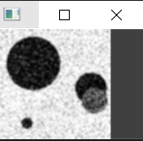

#### 2. Afin de détecter les contours de l'image nous avons utilisé un filtre de Sobel

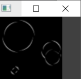

#### 3. Détermination de la valeur de seuil pour la détection de contour

Première tentative détecte qu'un seul grand cercle qui n'existe pas

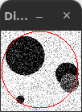

Nous avons essayer notre algorithme avec plusieurs cercles.
Ils étaient placés de manière incohérente, avec une mauvaise taille.

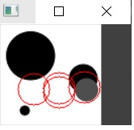

Ce problème ne venait pas de l'algorithme en lui même mais de l'implémentation en C++.

En effet, lorsqu'on appelait la méthode pour récupérer la valeur du gradient d'un pixel on utilisait le mauvais type.
Cette mauvaise manipulation changeait la valeur :

```cpp
if ((img.at<int>(i, j)) > gradient_threshold)
```

```cpp
if ((img.at<uchar>(i, j)) > gradient_threshold)
```

Suite à la correction ci-dessus nous avions un meilleur résultat :

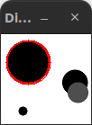

Cependant seul le plus grand cercle était détecté.

Pour pallier à ce problème on normalise les valeurs des cercles en fonction du périmètre des cercles.

```cpp
acc[r][c][radius] += 1.f/(2*M_PI*radius);
```

Suite à la normalisation nous avons pu détecter un cercle plus petit :

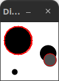

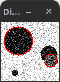

Ensuite nous avons été confrontés au problème de détection de plusieurs cercles quasi-identiques en terme de position et de rayon :

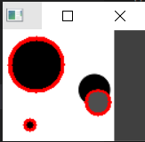

Nous avons donc utilisé la stratégie de recherche des maximums locaux. On a choisi de garder pour chaque voisinnage de 27 possiblités adjacente la valeur la plus élevée. Ainsi nous avons pu grandement augmenter la variété des cercles détéctés :

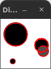
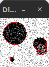

Cependant cette recherche réduisait fortement les performances. Après avoir fait une revue du code nous avons decouvert
plusieurs erreurs.

- Lors du parcours des 26 cases voisines, nous parcourions plus de cases que nécessaire.

- Nous utilisons un tableau qui contient les valeurs de 26 cases voisines, cependant il n'était pas réintialiser ce qui comprometait le bon résultat et les performances.

Après avoir appliqué les correctifs certains cercles côte à côte était détecté.

En regardant plus de cases voisine (31 cases voisines) on élimine ces cercles.

Grâce à ces corrections nous avons pu détecter les cercles de l'images coins2.png dans un temps acceptable (65 secondes) :

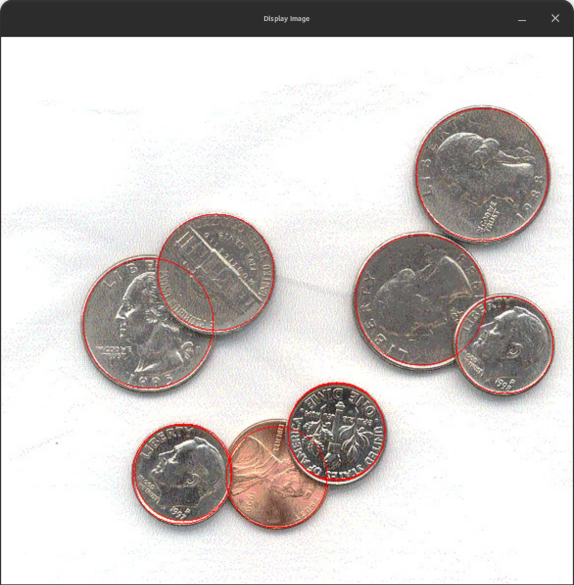

Afin de détecté les cercles nous avons utilisé des paramètres différents en fonction des images :

four.jpg :

> gradient threshold = 100  
> nb de cases voisines = 31  
> radius minimum = 5  
> nb de cercle à détecter = 5

fourn.jpg :

> gradient threshold = 160  
> nb de cases voisines = 31  
> radius minimum = 5  
> nb de cercle à détecter = 5

MoonCoin.png :

> gradient threshold = 100  
> nb de cases voisines = 31  
> radius minimum = 5  
> nb de cercle à détecter = 1

coins.jpg :

> gradient threshold = 115  
> nb de cases voisines = 31  
> radius minimum = 5  
> nb de cercle à détecter = 2

coins2.jpg :

> gradient threshold = 200  
> nb de cases voisines = 31  
> radius minimum = 50  
> nb de cercle à détecter = 10

## Exercice 3

### Temps de calcul

Temps de calcul pour `Four.png` : 0.857161 s

L'algorithme est de l'ordre $N⁴$ car on parcours tous les pixels de l'image de taille $N \times N$ (on est déjà à $N²$) puis pour chacun des pixels de contour on reparcours l'image une deuxième fois pour remplir l'accumulateur : $N² \times N² = N⁴$

### Temps de calcul estimé pour une image 600x600

On fait une règle de trois pour obtenir le temps d'exécution estimé.

$nb\,tour\,de\,boucle * tps\,exec / nb\,tour\,boucle = 600⁴ \times 0.8/ 100⁴ \approx 19,2 min$
